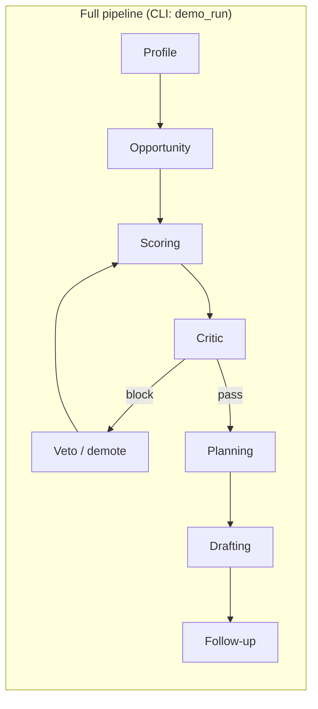

# How ApplySmart works (plain-language guide)

This file is **temporary** — read it, share it with teammates, then delete it if you like.

---

## 1. What you are building (one sentence)

**ApplySmart** takes a student’s **profile** (forms + GitHub + resume), finds **scholarship-like opportunities**, **scores** them, lets a **Critic** reject bad matches, then outputs a **plan**, **draft emails/SOP outline**, and **follow-ups** — all wired as a **single pipeline** in code.

---

## 2. The kitchen analogy

Think of a **conveyor belt** in a kitchen:

| Station | Plain English |
|--------|----------------|
| **Profile** | Gather ingredients: who you are, GPA, interests, links, resume text. |
| **Opportunity** | Go shopping: search the web (or use demo placeholders) for “things to apply to”. |
| **Scoring** | Taste-test and rank: which options look best for *you*? |
| **Critic** | Health inspector: “This #1 pick is actually invalid — remove it and re-rank.” |
| **Planning** | Write a week-by-week checklist. |
| **Drafting** | Fill in email + essay outline templates. |
| **Follow-up** | List reminder-style next steps. |

Each station is a **function in Python**, not a separate chatbot. The “agent” name means **a step with a clear job**, like an assembly line role.

---

## 3. What actually runs the pipeline?

A library called **LangGraph** connects those stations into a **graph** (a flowchart with possible loops).

- **State** = one big Python object (`ApplySmartState`) that holds everything so far: profile, list of opportunities, scores, critic decision, plan, drafts, etc.
- After each step, the graph passes the **updated state** to the **next** step.
- If the ** Critic** says **block**, the graph can send the state **back** to **Scoring** (after adjusting the list) — that’s the **loop** you see in the code.

**Important:** There is **no OpenAI/Anthropic call** inside these steps right now. The “smart” parts are **rules**, **search**, and **templates**. You *can* add an LLM later (e.g. for drafting).

---

## 4. Visual: order of steps



- **Profile → Opportunity → Scoring** always happens in that order once.
- **Critic → (maybe Veto → Scoring again)** can repeat a few times if something is blocked.
- **Planning → Drafting → Follow-up** runs after the critic path finishes.

---

## 5. Two different “products” in the same repo

| Piece | What it is | What it runs |
|--------|------------|----------------|
| **Web UI** (`uvicorn` + browser) | Wizard: links, resume upload, basic details, “AI analysis” | Mostly **Profile**-side work: build structured profile, CV markdown, logs. **It does not run the full 7-step LangGraph in one button** unless you later wire that. |
| **CLI demo** (`python -m applysmart.scripts.demo_run`) | Terminal demo | Runs the **entire graph**: Profile through Follow-up. |

So: **same concepts**, different entry points. Judges who want to see **Opportunity → Critic → Planning** should see **`demo_run`** (or you extend the API to invoke `build_app().invoke(...)`).

---

## 6. What lives in each folder (mental map)

```text
backend/applysmart/
  agents/          ← one file per “station” (profile, opportunity, scoring, …)
  graph/           ← LangGraph: wires agents + the critic loop
  models/          ← data shapes: Profile, Opportunity, ApplySmartState, …
  services/        ← search, resume text, GitHub, rerank helpers, …
  api/             ← FastAPI + static profile.html
```

---

## 7. “ApplySmartState” in human terms

One backpack carried through the whole pipeline:

- **`profile`** — you.
- **`opportunities`** — raw list from search or cache.
- **`scored`** — same ideas, but with scores and buckets (safe / target / reach).
- **`critic`** — pass, warn, or block + reason.
- **`plan`** — short roadmap text per day.
- **`drafts`** — email subject/body + SOP bullet outline.
- **`followups`** — fake “remind me in N days” items.
- **`meta`** — extras (e.g. whether search was “live”, critic trace, veto count).

---

## 8. CGPA / scale (why we added “out of”)

Programs often quote minimum GPA on a **~4.0 US-style** scale. Your transcript might be **out of 4, 4.5, 5, or 10**. The model stores:

- **`gpa`** — number on *your* transcript.
- **`gpa_scale_max`** — what that number is “out of”.

Matching compares a **converted** value to program minimums so **8.5/10** and **3.4/4** are handled fairly in code.

---

## 9. If you still feel lost — start here

1. Run **`python -m applysmart.scripts.demo_run`** and read the printed panels top to bottom.
2. Open **`applysmart/graph/langgraph_app.py`** — only the edges and node names; that *is* the story.
3. Pick **one** agent file, e.g. **`agents/scoring.py`**, and read what it reads from `state` and what it writes back.

---

## 10. Delete this file when you are done

This was created as a **temporary explainer** only. Remove **`TEMP-how-applysmart-works.md`** from the repo whenever you like.
